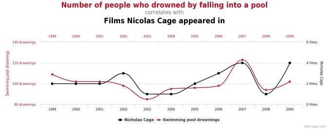
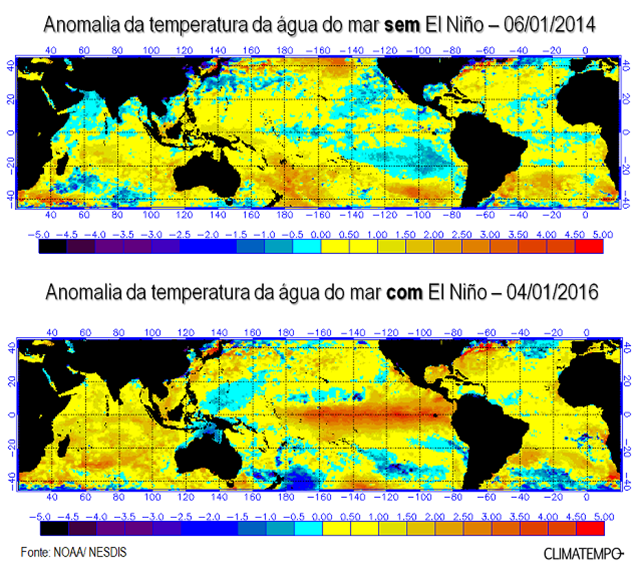
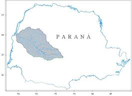
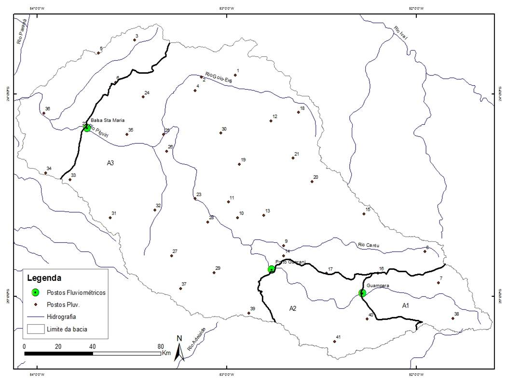

```{r setup, include=FALSE}
options(htmltools.dir.version = FALSE)
```

# Apresentação

* Fernando Corrêa
* Bacharel e mestrando em estatística
* Sócio da [curso-r](https://www.curso-r.com)


---

class: center, middle

## O que o estatístico deveria saber fazer?


---

# O que é EDA?

- EDA é sobre as setas
- Formalmente, qualquer coisa que não seja um modelo ou inferência estatística é análise exploratória de dados
- Não é a análise completa
- "Análise exploratória de dados nunca pode ser a história completa, mas nenhuma outra coisa pode servir como o primeiro passo."

---

# O que é EDA?

- Na justiça criminal existem duas figuras:
    - Os investigadores, que coletam **evidências**, garantem a materialidade do crime, definem os **suspeitos** etc
    - Os julgadores, que **julgam** as **conclusões** que se podem chegar com base nas evidências
- A análise exploratória de dados é uma **investigação** inicial das hipóteses de pesquisa

---

# Pressupostos da EDA

- **Variáveis explicativas** versus **Variáveis resposta**
- Hipóteses de pesquisa:
    - Quais variáveis coletadas impacatam as variáveis resposta? (como e porquê)
- Verificar hipóteses dos modelos (caso já existam modelos candidatos)

---

# Por que a EDA é importante?

- Ir diretamente para os modelos pode ser mais rápido, mas o julgamento não terá a mesma segurança das verificações preliminares de uma EDA
- Dependendo do delineamento do estudo, a EDA pode ser supérflua, mas é possível que a análise desemboque em outras hipóteses não mapeadas inicialmente 

---

# PRERIGO!


---

# EDAS sem pressupostos podem dar muito errado!


---

# Suspeitos de sempre

Sintoma de problemas: "Vamos cruzar tudo com tudo?"
--

- EDA problemática 1: Falta de hipóteses



--

--

- EDA problemática 2: Falta de variáveis resposta 

--
---

# Cuidados especiais

Sempre tenha em mente:

- Qualquer análise fica sem sentido se você não tiver **variáveis resposta**
- **Hipóteses** são pontos de referência importantes
    - A análise exploratória é um "passo-a-passo" que responde questões de pesquisa
- Todo o conteúdo de uma análise exploratória é meramente **descritivo**. As conclusões são sempre da forma "os dados dizem que ..."
- O passo seguinte é **concluir** e **afirmar**
- O gráfico, por si só, não afirma nada

---

# Enfim, EDA!

- Tendo os **porquês** da análise, resta agora explorar o **como**
- Como se faz EDA?
    - Tabelas
    - Gráficos específicos para situações específicas
    - Comunicar os resultados

---

# Exemplo: Influência do IOS na Precipitação e Vazão de Águas

- Existem duas anomalias de temperatura nas águas do Oceano pacífico:
    - La Niña (resfriamento das águas do Pacífico Leste)
    - El Niño (aquecimento das águas do Pacífico Leste)
- Presença medida pelo IOS
- Impacta o regime fluvial do Sul do Brasil

---



---

# Objetivo do estudo

Caracterizar o impacto do El Niño/La Niña no Clima da bacia do Piquiri.


---

  

---

## Variáveis observadas

### Precipitação
    
- Quantidade de chuva ($mm$).
- Medida em 41 pluviomêtros eletrônicos.
- Dados **mensais**.

### Vazão

- Rapidez com a qual o volume de ?gua escoa ($m^3$/s).
- Medida em 3 estações fluviom?tricas.
- Dados **mensais**.

### IOS

- Mede a ocorrência de El Niño/La Niña
- Dados **mensais**

---
class: center, middle

# Todo estatístico deveria ser programador?


---
class: center, middle

# Todo estatístico deveria programar?


---

# Organizando a EDA

- **Variáveis resposta**: Precipitação e Vazão
- **Variáveis explicativas**: Mês, Ano, IOS, Presença de El Niño/La Niña
- **Hipóteses**:
    - IOS impacta (aumenta ou diminui) a precipitação e a vazão
    - Precipitação e vazão tem alguma relação
        - Vazão é uma função da precipitação
    - Sazonalidade é um fenômeno comum em séries pluviométricas
- **Perguntas**:
    - A influcência da precipitação na vazão é imediata?
    - A influência do IOS na vazão/precipitação é imediata?

---

# Estratégia de análise

- É importante analisar cada estação pluviométrica separadamente
- Precisamos entender as variáveis resposta:
    - Gráficos das séries temporais (2 gráficos)
    - Scatter-plot de vazão versus precipitação (1 gráfico)
    - scatter-plot de vazão versus precipitação do mês anterior (1 gráfico)
    - Auto correlação das séries temporais (2 gráficos)
- Precisamos entender como as variáveis explicativas impactam a resposta:
    - Boxplot das variáveis resposta versus meses (2 gráficos)
    - Scatter-plot do IOS versus variáveis resposta (2 gráficos)
    - Auto correlação cruzada das séries temporais vs IOS (2 gráficos)
- Repetir os gráficos por bacia: 12*3 = 36 gráficos

---

# Organizando os gráficos

- `analise_descritiva.R`
- Gráficos das séries temporais (2 gráficos) `plota_vazao`
- Scatter-plot de vazão versus precipitação (1 gráfico) `plota_vazao_versus_precipitacao`
- scatter-plot de vazão versus precipitação do mês anterior (1 gráfico) `plota_vazao_versus_precipitacao`
- Auto correlação das séries temporais (2 gráficos) `plota_acf_*`
- Boxplot das variáveis resposta versus meses (2 gráficos) `sazonalidade_*`
- Scatter-plot do IOS versus variáveis resposta (2 gráficos) `plota_IOS_e_*`
- Auto correlação cruzada das séries temporais vs IOS (2 gráficos) `plota_ccf_*_IOS`

---

No R

---

# Conclusão

Pontos mais importantes da EDA:
    - Tenha foco!
    - Seja metódico!
Escolha os gráficos e tabelas que melhor ajudam nas comparções que você tem interesse
Tenha em mente que análises descritivas não são (e nem devem sugerir que são) definitivas

---